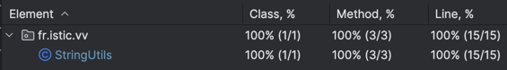
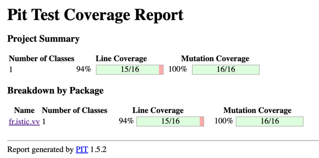

# Balanced strings

A string containing grouping symbols `{}[]()` is said to be balanced if every open symbol `{[(` has a matching closed symbol `)]}` and the substrings before, after and between each pair of symbols is also balanced. The empty string is considered as balanced.

For example: `{[][]}({})` is balanced, while `][`, `([)]`, `{`, `{(}{}` are not.

Implement the following method:

```java
public static boolean isBalanced(String str) {
    ...
}
```

Use the coverage criteria studied in classes as follows:

1. Use input space partitioning to design an initial set of inputs. Explain below the characteristics and partition blocks you identified.
2. Evaluate the statement coverage of the test cases designed in the previous step. If needed, add new test cases to increase the coverage. Describe below what you did in this step.
3. If you have in your code any predicate that uses more than two boolean operators, check if the test cases written so far satisfy *Base Choice Coverage*. If needed, add new test cases. Describe below how you evaluated the logic coverage and the new test cases you added.
4. Use PIT to evaluate the test suite you have so far. Describe below the mutation score and the live mutants. Add new test cases or refactor the existing ones to achieve a high mutation score.

`isBalanced` returns `true` if `str` is balanced according to the rules explained above. Otherwise, it returns `false`.

Write below the actions you took on each step and the results you obtained.
Use the project in [tp3-balanced-strings](../code/tp3-balanced-strings) to complete this exercise.

## Answer

### 1 - Use input space partitioning to design an initial set of inputs. Explain below the characteristics and partition blocks you identified.

#### Caractéristique identifié : 
> **Longueur de la String en paramètre can have varying lengths**

**Partition :**
- Chaine vide ("")
- Chaine de caractère courte (1-3 characters)
- chaine de caractère moyenne (4-10 characters)
- Longue chaine de caractère (>10 characters)

> **la chaine de caractère peut contenir que des groupping symbole, un mix de grouping symbole et d'autres caractère ou aucun grouping symbol.**

**Partition :**
- Que des grouping symbol ("{}", "[]", "()", etc.)
- Mix groupping symbols + caractère normaux  ("a{b}c", "1[2]3", etc.)
- Pas de grouping symbol ("abc", "123", etc.)

> **Le type et l'ordre des grouping symbol peuvent changer**

**Partition :**
- Un seul type équilibré ("()", "{}{}", etc.)
- Plusieurs types, balanced ("{[]}", "({[]})", etc.)
- Un seul type, unbalanced ("((", ")(", etc.)
- Plusieurs types, unbalanced ("{[}]", "[{]}", etc.)
- types imbriqués balanced ("({[]})", "[{()}]")
- types imbriqués unbalanced ("({[}])", "[({)]}")

> **La chaine de caractère peut contenir des caractères autres que des grouping symbole**

**Partition :**
- grouping symbole avec caractères spéciaux ("(*&%{^}", "")
- caractères spéciaux seuls ("@#!", "<>|~", etc.)

> **Le paramètre d'entrée peut être null ou vide**

**Partition :**
- Null input (null)
- Empty string ("")

---

En se basant sur ces caractéristiques on peut définir les cas de test à réaliser :  

| **Test Case (TC)** | **Description**                             | **Input**             | **Expected Output**              |
|--------------------|---------------------------------------------|-----------------------|----------------------------------|
| **TC1**            | Empty string                                | `""`                  | `true`                           |
| **TC2**            | Null input                                  | `null`                | `throw illegalArgumentException` |
| **TC3**            | Single type, balanced                       | `"()"`                | `true`                           |
| **TC4**            | Single type, unbalanced                     | `"((`                 | `false`                          |
| **TC5**            | Multiple types, balanced                    | `"{[()]}"`            | `true`                           |
| **TC6**            | Multiple types, unbalanced                  | `"({[}])"`            | `false`                          |
| **TC7**            | Nested balanced brackets                    | `"[{({[]})}]"`        | `true`                           |
| **TC8**            | Nested unbalanced brackets                  | `"[{({[}])}]"`        | `false`                          |
| **TC9**            | Mixed characters, balanced                  | `"a(b)c{d}[e]"`       | `true`                           |
| **TC10**           | Mixed characters, unbalanced                | `"a(b{c)d}"`          | `false`                          |
| **TC11**           | Special characters with balanced brackets   | `"@{[()]!}"`          | `true`                           |
| **TC12**           | Special characters with unbalanced brackets | `"@{[()!}]"`          | `false`                          |
| **TC13**           | No brackets                                 | `"abc123"`            | `true`                           |
| **TC14**           | Long input, balanced                        | `"({[{}()]}){}[()]"`  | `true`                           |
| **TC15**           | Long input, unbalanced                      | `"({[{}()]}){}[()]}"` | `false`                          |
| **TC16**           | Single closing bracket without opening      | `")"`                 | `false`                          |
| **TC17**           | Single opening bracket without closing      | `"("`                 | `false`                          |


### 2 - Evaluate the statement coverage of the test cases designed in the previous step. If needed, add new test cases to increase the coverage. Describe below what you did in this step.

> Après avoir écrit tous ces tests, et lancer le coverage on obtient un résultat de 100% :
> 
> 

Il ne semble donc pas utile de rajouter des cas de tests.


### 3 - If you have in your code any predicate that uses more than two boolean operators, check if the test cases written so far satisfy *Base Choice Coverage*. If needed, add new test cases. Describe below how you evaluated the logic coverage and the new test cases you added.

Dans notre méthode isBalanced, le seul prédicat complexe se trouve dans la méthode `isMatchingPair`, qui contient trois conditions reliées par des opérateurs logiques `OR` :

`(open == '(' && close == ')') || (open == '[' && close == ']') || (open == '{' && close == '}')`.

Ce prédicat a trois sous-conditions indépendantes, et chaque test devra couvrir les cas suivants :
- Un seul des OR est vrai.
- Tous les OR sont faux.

Tous ces cas de tests sont déja testé. Il n'y a donc pas besoin de rajouter des cas de tests.

### Use PIT to evaluate the test suite you have so far. Describe below the mutation score and the live mutants. Add new test cases or refactor the existing ones to achieve a high mutation score.

En lancant pit test, on obtient le résultat suivant :



On constate alors que la seul ligne qui n'est pas testé est le constructeur privé : 

`private StringUtils() {}`

Il n'est donc pas utile de rajouter des cas de tests, ca il ne sert qu'a éviter l'instanciation d'une class StringUtils.


