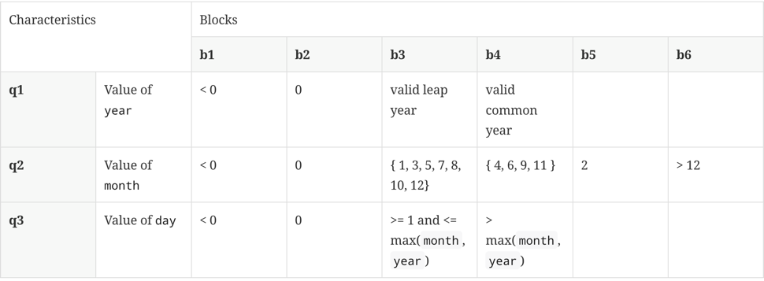
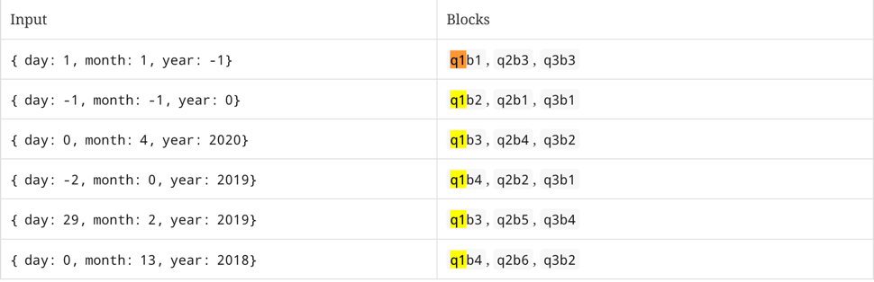
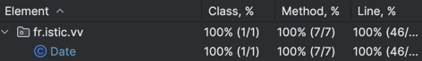
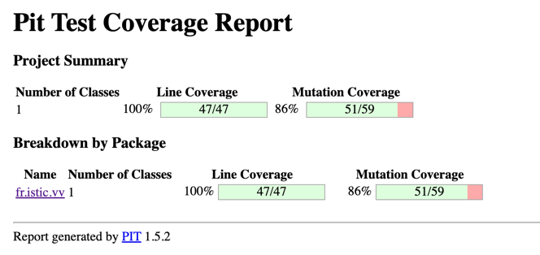
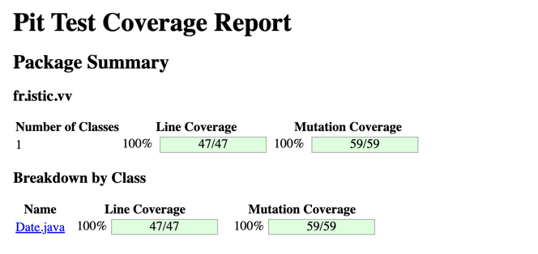

# Test the Date class

Implement a class `Date` with the interface shown below:

```java
class Date implements Comparable<Date> {

    public Date(int day, int month, int year) { ...}

    public static boolean isValidDate(int day, int month, int year) { ...}

    public static boolean isLeapYear(int year) { ...}

    public Date nextDate() { ...}

    public Date previousDate

    { ...}

    public int compareTo(Date other) { ...}

}
```

The constructor throws an exception if the three given integers do not form a valid date.

`isValidDate` returns `true` if the three integers form a valid year, otherwise `false`.

`isLeapYear` says if the given integer is a leap year.

`nextDate` returns a new `Date` instance representing the date of the following day.

`previousDate` returns a new `Date` instance representing the date of the previous day.

`compareTo` follows the `Comparable` convention:

* `date.compareTo(other)` returns a positive integer if `date` is posterior to `other`
* `date.compareTo(other)` returns a negative integer if `date` is anterior to `other`
* `date.compareTo(other)` returns `0` if `date` and `other` represent the same date.
* the method throws a `NullPointerException` if `other` is `null`

Design and implement a test suite for this `Date` class.
You may use the test cases discussed in classes as a starting point.
Also, feel free to add any extra method you may need to the `Date` class.

Use the following steps to design the test suite:

1. With the help of *Input Space Partitioning* design a set of initial test inputs for each method. Write below the
   characteristics and blocks you identified for each method. Specify which characteristics are common to more than one
   method.
2. Evaluate the statement coverage of the test cases designed in the previous step. If needed, add new test cases to
   increase the coverage. Describe below what you did in this step.
3. If you have in your code any predicate that uses more than two boolean operators check if the test cases written to
   far satisfy *Base Choice Coverage*. If needed add new test cases. Describe below how you evaluated the logic coverage
   and the new test cases you added.
4. Use PIT to evaluate the test suite you have so far. Describe below the mutation score and the live mutants. Add new
   test cases or refactor the existing ones to achieve a high mutation score.

Use the project in [tp3-date](../code/tp3-date) to complete this exercise.

## Answer

## 1 - Partitionement par méthodes :

### Méthode maxDay(int month, int year)

#### Caractéristiques : 

**Février (mois 2) :**

- 29 jours si l'année est bissextile.
- 28 jours sinon.

**Les mois: avril (4), juin (6), septembre (9), novembre (11)**
- Toujours 30 jours.

**Les mois restants : janvier (1), mars (3), mai (5), juillet (7), août (8), octobre (10), décembre (12).**
- Toujours 31 jours.

**Mois invalides :**
- Si month < 1 ou month > 12, une exception doit être levée.

| **TestCase ID** | **Entrées : `month`, `year`** | **Résultat attendu**          | **Description**                            |
|-----------------|-------------------------------|-------------------------------|--------------------------------------------|
| TC1             | `2, 2024`                     | `29`                          | Février d'une année bissextile (2024).     |
| TC2             | `2, 2023`                     | `28`                          | Février d'une année non bissextile (2023). |
| TC3             | `4, 2024`                     | `30`                          | Avril, un mois avec 30 jours.              |
| TC4             | `1, 2024`                     | `31`                          | Janvier, un mois avec 31 jours.            |
| TC5             | `0, 2024`                     | **IllegalArgument Exception** | Mois invalide (< 1).                       |
| TC6             | `13, 2024`                    | **IllegalArgument Exception** | Mois invalide (> 12).                      |

---

### Méthode isValidDate(day, month, year)

Pour la méthode `isvalidDate` on peut reprendre les données du cours :





>Au cours des tests, nous avons constaté qu'un test ne passait pas lorsque le jour était égal à `maxDay` dans le cas d'une année bissextile. Afin de corriger cela et 
>d'assurer une couverture complète des cas de dates valides et invalides, nous avons ajouté les nouveaux cas de test suivants :
>
>- **`TC7`** : Ce test vérifie la validité d'une date dans le cadre d'une année bissextile, en particulier pour le 29 février 2016, qui est un jour valide dans cette année.
>- **`TC8`** : Ce test évalue une date invalide pour le 30 février 2016, ce qui n'est pas possible, même dans une année bissextile.
>
>Nous avons également étendu les tests pour couvrir d'autres scénarios, notamment :
>- **`TC9`** et **`TC10`** : Vérification de la validité du 29 février en 2019, une année non bissextile. Le test **`TC9`** assure que le 28 février 2019 est valide, tandis que **`TC10`** confirme que le 29 février 2019 est une date invalide.
>- **`TC11` et `TC12`** : Ces tests valident respectivement le 31 mars et le 30 avril 2019, qui sont des dates valides dans leurs mois respectifs.
>- **`TC13`** : Ce test vérifie que le 31 avril 2019 est une date invalide, puisque le mois d’avril ne compte que 30 jours.

Ces ajouts permettent de mieux couvrir les différents scénarios de dates limites, en particulier en tenant compte des années bissextiles et des mois ayant un nombre maximal de jours différents.


### Constructeur Date(day, month, year)

Pour les caractéristique du constructeur, ayant déja testé la méthode isValidDate. On peut simplement imaginer qu'il prend en paramètre une année valide ou une année invalide.

on a donc deux test cases :

| TC | Caractéristique | Input                           | Result                   |
|----|-----------------|---------------------------------|--------------------------|
| 1  | Date valide     | day = 1, month = 2, year = 2024 |                          |
| 2  | Date invalide   | day = 0, month = 2, year = 2024 | `throw RuntimeException` |

### Méthode compareTo()

#### Caractéristiques:

**Années des dates :**
- Année de la première date < Année de la seconde date.
- Année de la première date == Année de la seconde date.
- Année de la première date > Année de la seconde date.

| **Test Case (TC)**                    | **Condition**                                         | **Résultat attendu** |
|---------------------------------------|-------------------------------------------------------|----------------------|
| Année différente                      | Année de la première date < Année de la deuxième date | `<0`                 |
|                                       | Année de la première date > Année de la deuxième date | >0                   |
| Même année, mois différent            | Mois de la première date < Mois de la deuxième date   | `<0`                 |
|                                       | Mois de la première date > Mois de la deuxième date   | `>0`                 |
| Même année, même mois, jour différent | Jour de la première date < Jour de la deuxième date   | `<0`                 |
|                                       | Jour de la première date > Jour de la deuxième date   | `>0`                 |
| Dates identiques                      | Année, mois, et jour sont identiques                  | `==0`                |


### Méthode nextDate()

#### Caractéristiques : 
**Année bissextile et mois de février :**
- Dans une année bissextile, février a 29 jours.
- Dans une année non bissextile, février a 28 jours.
- Les tests doivent s'assurer que la méthode nextDate() gère correctement ces différences.

**Mois de 31 jours :**
- Janvier, mars, mai, juillet, août, octobre et décembre ont 31 jours.
Si le jour est le 31, il doit passer au 1er du mois suivant.

**Mois de 30 jours :**
- Avril, juin, septembre et novembre ont 30 jours.
Si le jour est le 30, il doit passer au 1er du mois suivant.

**Mois de 28 jours :**
- Février a 28 jours dans une année non bissextile et 29 jours dans une année bissextile.
- Si le jour est le 28 ou 29, il doit passer au 1er du mois suivant.
Il faut tester les deux cas (année bissextile et non bissextile).

| **Test Case (TC)** | **Jour (day)** | **Mois (month)** | **Année (year)** | **Description**                                                                 | **Attendu**  |
|--------------------|----------------|------------------|------------------|---------------------------------------------------------------------------------|--------------|
| **TC1**            | `15`           | `5`              | `2024`           | Jour au milieu du mois (pas de changement de mois ou d'année)                   | `16/05/2024` |
| **TC2**            | `30`           | `4`              | `2024`           | Dernier jour d'avril (30 jours) (pas de changement d'année)                     | `01/05/2024` |
| **TC3**            | `31`           | `12`             | `2024`           | Dernier jour de l'année (31 décembre) (changement de mois et d'année)           | `01/01/2025` |
| **TC4**            | `28`           | `2`              | `2024`           | Dernier jour de février d'une année bissextile (29 jours)                       | `29/02/2024` |
| **TC5**            | `28`           | `2`              | `2023`           | Dernier jour de février d'une année non bissextile (28 jours)                   | `01/03/2023` |
| **TC6**            | `31`           | `1`              | `2024`           | Dernier jour de janvier (31 jours) (changement de mois sans changement d'année) | `01/02/2024` |
| **TC7**            | `1`            | `12`             | `2024`           | Premier jour de décembre (pas de changement d'année)                            | `02/12/2024` |

### Méthode previousDate()

### Méthode previousDate()

#### Caractéristiques :
**Année bissextile et mois de février :**
- Dans une année bissextile, février a 29 jours.
- Dans une année non bissextile, février a 28 jours.
- Les tests doivent s'assurer que la méthode `previousDate()` gère correctement ces différences en revenant au jour précédent.

**Mois de 31 jours :**
- Janvier, mars, mai, juillet, août, octobre et décembre ont 31 jours.
  Si le jour est le 1er, il doit revenir au dernier jour du mois précédent (31 ou 30 selon le mois).

**Mois de 30 jours :**
- Avril, juin, septembre et novembre ont 30 jours.
  Si le jour est le 1er, il doit revenir au 30 du mois précédent.

**Mois de 28 jours :**
- Février a 28 jours dans une année non bissextile et 29 jours dans une année bissextile.
- Si le jour est le 1er mars, il doit revenir au dernier jour de février (28 ou 29 selon l'année).
  Il faut tester les deux cas (année bissextile et non bissextile).

| **Test Case (TC)** | **Jour (day)** | **Mois (month)** | **Année (year)** | **Description**                                                                 | **Attendu**  |
|--------------------|----------------|------------------|------------------|---------------------------------------------------------------------------------|--------------|
| **TC1**            | `15`           | `5`              | `2024`           | Jour au milieu du mois (pas de changement de mois ou d'année)                   | `14/05/2024` |
| **TC2**            | `1`            | `5`              | `2024`           | Premier jour de mai (mois de 31 jours) (retour au dernier jour d'avril)         | `30/04/2024` |
| **TC3**            | `1`            | `1`              | `2025`           | Premier jour de janvier (mois de 31 jours) (retour au dernier jour de décembre) | `31/12/2024` |
| **TC4**            | `1`            | `3`              | `2024`           | Premier jour de mars dans une année bissextile (retour au 29 février)           | `29/02/2024` |
| **TC5**            | `1`            | `3`              | `2023`           | Premier jour de mars dans une année non bissextile (retour au 28 février)       | `28/02/2023` |
| **TC6**            | `1`            | `2`              | `2024`           | Premier jour de février (année bissextile) (retour au 31 janvier)               | `31/01/2024` |
| **TC7**            | `2`            | `12`             | `2024`           | Deuxième jour de décembre (pas de changement d'année)                           | `01/12/2024` |

## 2 - Evaluate the statement coverage of the test cases designed in the previous step.

En exécutant ces tests nous obtenons un coverage de 100%. Il n'est donc pas indispensable de rajouter de nouveaux cas de tests.




## 3 - If you have in your code any predicate that uses more than two boolean operators check if the test cases written to far satisfy *Base Choice Coverage*.

>**predicate 1 : `month <= 0 || month > 12`**
>
> on teste bien dans les tests unitaire que month ==-1 et month > 12. pas besoin de Tests supplémentaire.

>**predicate 2 : `day > 0 && day <= maxDay`**
>
> on teste bien dans les tests unitaire que day ==-1, day >maxday, day<=maxDay, et day > 0. Donc il n'y a pas besoin de nouveaux cas de tests.


## 3 - Use PIT to evaluate the test suite you have so far. Describe below the mutation score and the live mutants. Add new

Lorsque l'on lance pour la première fois pittest, on obtient ce résultat :



On constate premièrement qu'à la ligne `if (year < 1) {` (méthode isValid) une mutation de type **changed conditional boundary** survit. 

En observant les tests, on se rend compte qu'on teste bien pour une année <1 tel que année = -1. Sauf que si on modifie la condition telle que `if (year <= 1) {` les tests passe toujours. 

Pour y remédier on peut rajouter un cas de tests : `testisValid_TC1_mutation` qui va tester la méthode `isValid` avec une année = 1. En relancant pit-test on constate que la mutation est bien "tué".


On constate également que des mutations sur les conditions `newDay > maxDay` et `newMonth > 12)` (méthode nextDate) survivent de la même manière. On rajoute donc les tests : 

- testNextDate_mutation1
- testNextDate_mutation2
- testNextDate_mutation3
- testNextDate_mutation4

Qui vont tous les trois vérifier le comportement ou le nouveau jours (nextDay) est la même que maxDay. Ainsi en cas de changement des conditions `newDay > maxDay` en `newDay >= maxDay` ou `newMonth > 12` en `newMonth >= 12` les tests ne passeront plus.

DE la même manière pour la méthode previousDate, des mutation survivent sur les conditions : `if (newDay < 1) {` et `if (newMonth < 1) {`. On rajoute donc des tests : 

- testPreviousDate_mutation1
- testPreviousDate_mutation4

La dernière condition sur lesquels de mutant survivent se trouve dans `isleapyear` : `((year % 4 == 0) && (year % 100 != 0) || (year % 400 == 0))`

Elle n'avait pas été suffisamment testé. On ralisé donc 4 nouveaux tests : 
- testIsLeapYear_DivisibleBy4NotBy100
- testIsLeapYear_DivisibleBy100NotBy400
- testIsLeapYear_DivisibleBy400
- testIsLeapYear_NotDivisibleBy4

On obtient finalement un résultat beaucoup plus satisfaisant. Et on peut désormais considérer que la classe `Date` à suffisamment été testé.




